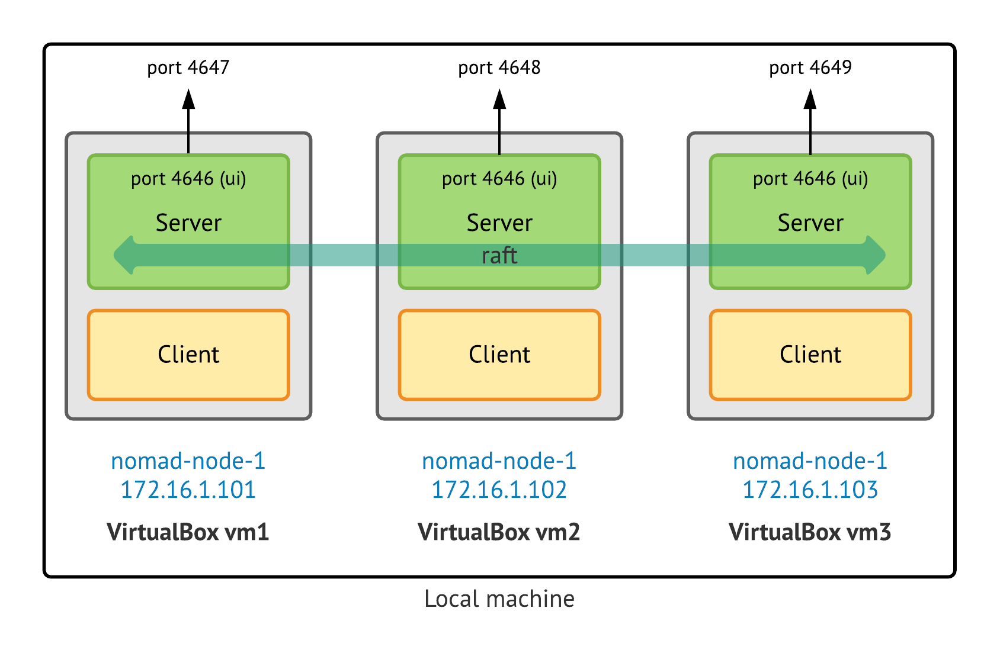

# Nomad-Vagrant sandbox
The Vagrantfile script will spin up local Nomad cluster (3 nodes) for test and development purposes.

## Quick start

### Creation of base nomad Vagrant box.  
1. Navigate to `./nomad_vagrantbox_build`.
2. Run `make nomad-docker-box`.

### Populate the Nomad cluster (3 nodes)
1. Navigate to `./nomad_cluster`.
2. Run `make nomad-cluster`.

## Local infrastructure diagram
